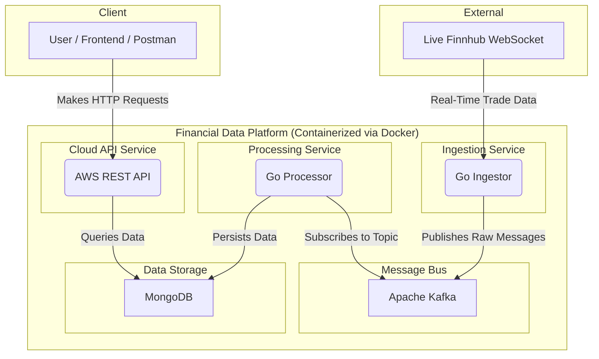

# End-to-End Real-Time Financial Data Platform


An end-to-end, event-driven data platform built in Go. This system ingests live financial data from a WebSocket, streams it through a Kafka message bus, processes and stores it in MongoDB, and exposes it via a clean, well-tested REST API.

## Live Demo

The API service is deployed to AWS (EC2).

*   **Status**: *Note: To conserve cloud resources, this instance is stopped when not in use. Please contact me to request a live demonstration and IP address.*

## System Architecture

The project is a multi-microservice application, fully containerised with Docker, demonstrating a decoupled, scalable, and resilient architecture.



## Key Features & Technical Highlights

This project was architected to satisfy many Non-Functional Requirements (NFRs).
### 1. Availability & Scalability
*Designed to handle growth and maintain high availability.*
*   **Decoupled & Resilient Architecture**: The Ingestion and Processing services are fully decoupled using **Apache Kafka**. This acts as a durable buffer, ensuring that if the database is slow or temporarily unavailable, no incoming real-time data is lost.
*   **Horizontal Scalability via Consumer Groups**: The processing service is designed to be scaled out. Kafka's **consumer group** model guarantees that each message is delivered to exactly one processor instance, enabling safe, parallel processing of the data stream without duplication.
*   **Hybrid Cloud Deployment (Cost & Performance)**: To optimise resource usage, the system employs a hybrid strategy. The memory-intensive **Data Pipeline** (Ingestor, Kafka, Processor) runs on local infrastructure but writes directly to a centralised **MongoDB Atlas** cloud database. The **API Service** is deployed to a lightweight **AWS EC2 instance**, connecting to that same cloud database. This decouples the heavy processing from the query layer, ensuring the API remains available 24/7 via the public internet, accessible from anywhere, regardless of the state of the local ingestion pipeline.
### 2. Data Consistency & Integrity
*Ensuring data is durable, accurate, and safe during failures.*

*   **Deliberate Pivot to Eventual Consistency**: The initial design aimed for perfect atomicity using transactions. However, discovering that **MongoDB's Time Series engine does not support inserts within transactions** forced a deliberate architectural pivot. The system now prioritises the absolute durability of the raw trade data, updating aggregated metadata on a best-effort, eventually consistent basis.
*   **Idempotent Processing for Crash Recovery**: To prevent data duplication if the processor crashes and re-reads a message, the system generates a **deterministic idempotency key** from Kafka metadata (`topic-partition-offset--symbol-timestamp-index`). MongoDB's unique index rejects duplicate writes, guaranteeing **exactly-once** persistence logic.
*   **Graceful Shutdown**: The stateful `go-processor` catches `SIGINT` or `SIGTERM` signals. It finishes processing its in-flight Kafka message and commits the offset before exiting, ensuring **at-least-once** delivery is handled cleanly during deployments.
*   **Concurrent-Safe Metadata Updates**: To support horizontal scaling, the system handles concurrent writes to the same symbol metadata.
    1.   **`$inc`**: Used for the trade count to ensure every trade is counted, even if multiple processors update the same symbol simultaneously.
    2.  **`$max`**: Used for the `lastTradeAt` timestamp. This solves the "out-of-order write" race condition, ensuring the timestamp only moves forward to a later time and never regresses, even if an older message is processed last.
    3.   **Atomicity**: Because MongoDB guarantees atomicity for single-document updates, combining these into one operation guarantees concurrency safety.
### 3. API Performance & Design
*Optimising latency and developer experience.*

*   **Cursor-Based Pagination**: To efficiently paginate high-frequency time-series data, the `/trades` endpoint avoids slow `limit/offset` queries. Instead, it implements **cursor-based pagination**, which offers two critical advantages:
    1.  **Index-Optimised Performance**: By leveraging MongoDB's **Time Series index** on `symbol` (metadata field) and `time` (time field), the database allows for a fast "seek" to the correct position in the dataset.
    2.  **Data Stability**: In a live system where new trades are constantly inserted at the top of the list, traditional pagination causes "page drift" (skipping or repeating records). Using a timestamp cursor ensures that historical pages remain stable and consistent for the client, regardless of incoming live traffic.
*   **Robust Middleware Chain**: The API is protected by custom Gin middleware. A **Timeout Middleware** actively races handlers against a timer to prevent slow DB queries from exhausting server resources. A **Centralised Error Middleware** captures all failures (including timeouts) to ensure the API always returns a consistent, predictable JSON error response.
*   **Clean Architecture**: The codebase follows Clean Architecture principles (`Handler` -> `Usecase` -> `Repository`), separating concerns to ensure the system is maintainable and easy to extend.

### 4. DevOps & Quality Assurance
*Ensuring reliability through automation.*

*   **Automated CI Pipeline**: A **GitHub Actions** workflow serves as a strict quality gate, automatically running the full test suite on every push to `main`. This prevents regression and ensures that code works as intended on a neutral environment (as opposed to just local environment.)
*   **Comprehensive Testing Strategy**: The project is validated with a multi-layered strategy:
    1.  **Unit Tests**: 100% coverage on API business logic (Usecase) and 82% on Processor transformation logic.
    2.  **Request Layer Integration**: Validates the full interaction chain between Middleware, Handler and Usecase (96% middleware coverage).
    3.  **Repository Integration**: Runs against a **live MongoDB test database** to verify query behaviour and validate the **idempotency strategy** (82% repository coverage).

## Tech Stack

| Category      | Technology                                             |
|---------------|--------------------------------------------------------|
| **Language**  | Go                                                     |
| **Pipeline**  | Apache Kafka, Gorilla WebSocket                        |
| **API**       | Gin (Web Framework)                                    |
| **Database**  | MongoDB (with Time Series Collections)                 |
| **Testing**   | Go Standard Library, `testify`, `mockery`              |
| **CI/CD**     | GitHub Actions (Automated Testing)                     |
| **Infrastructure** | Docker, Docker Compose, AWS (EC2)                 |

## API Endpoints

The API provides the following MVP endpoints for data consumption:

#### Get All Tracked Symbols
- **Endpoint**: `GET /api/v1/symbols`
- **Description**: Returns metadata for all symbols the system has processed.
- **Example Response**:
  ```json
  {
      "data": {
          "available": [
              {
                  "symbol": "AMD",
                  "trade_count": 8,
                  "last_trade_at": "2025-11-20T12:42:48.093Z"
              },
              {
                  "symbol": "NVDA",
                  "trade_count": 7,
                  "last_trade_at": "2025-11-20T12:39:40.831Z"
              },
              {
                  "symbol": "TSLA",
                  "trade_count": 5,
                  "last_trade_at": "2025-11-20T12:41:40.175Z"
              }
          ]
      },
      "error": null,
      "message": null
  }
  ```

#### Get Latest Trades for a Symbol
- **Endpoint**: `GET /api/v1/trades/:symbol`
- **Description**: Returns a paginated list of the most recent trades for a symbol using efficient cursor-based pagination.
- **Query Parameters**: `limit` (int), `before` (Unix ms timestamp)
- **Example Response**:
  ```json
  {
      "data": {
          "data": [
              {
                  "timestamp": "2025-11-20T13:33:18.585Z",
                  "price": "196.38",
                  "volume": "265"
              },
              {
                  "timestamp": "2025-11-20T13:33:12.457Z",
                  "price": "196.29",
                  "volume": "100"
              },
              {
                  "timestamp": "2025-11-20T13:33:08.27Z",
                  "price": "196.39",
                  "volume": "115"
              },
              {
                  "timestamp": "2025-11-20T13:33:06.456Z",
                  "price": "196.49",
                  "volume": "100"
              },
              {
                  "timestamp": "2025-11-20T13:33:03.544Z",
                  "price": "196.6",
                  "volume": "300"
              }
          ],
          "pagination": {
              "next_cursor": 1763645583544
          }
      },
      "error": null,
      "message": null
  }
  ```

## Getting Started

### Prerequisites
*   Go (1.21+)
*   Docker & Docker Compose

### 1. Configuration

Create a `config/config.yml` file in the project root with the following structure, filling in your credentials:

```yml
api_port: "8000"

finnhub:
  token: YOUR_FINNHUB_TOKEN

kafka:standard address.
  broker_url: "kafka:29092" 
  topic: "raw_stock_ticks"

subscribed_symbols:
  - "AAPL"
  - "GOOGL"
  - "TSLA"
  - "MSFT"
  - "NVDA"
  - "AMD"

mongodb:
  url: YOUR_MONGODB_ATLAS_URL
  database_name: "financialDataDatabase"
  collection_name: "finnhub_trades"
  symbols_collection_name: "symbols"

timeouts:
  # For user-facing API requests. Should be short.
  api_request: "5s"
  # For background network operations (Kafka writes, DB writes). Can be longer.
  background_operation: "15s"
  # For graceful shutdown of services.
  shutdown: "5s"
```

### 2. Run the Application

From the project root, start the entire platform with a single command:
```bash
docker compose up --build
```
The API will be available at `http://localhost:8000`.

## Running Tests

The project includes a comprehensive test suite. To run all tests, you first need to provide a connection string for a test database in a `.env` file.

1.  **Create a `.env` file** in the project root:
    ```env
    # .env
    MONGO_URL_TEST="..."
    ```

2.  **Run the tests** with the coverage flag:
    ```bash
    go test ./... --cover
    ```

## Production Deployment (AWS)

The API service is designed to be deployed independently to a cloud provider. Here is the procedure for deploying the API to an AWS EC2 instance (Ubuntu):

1.  **Provision Infrastructure**: Launch a `t3.micro` instance and configure the Security Group to allow HTTP traffic on Port 80 (`0.0.0.0/0`).
2. 
```ssh -i "...pem" ubuntu@<NEW_IP_ADDRESS>```
3. 
```bash
sudo fallocate -l 2G /swapfile
sudo chmod 600 /swapfile
sudo mkswap /swapfile
sudo swapon /swapfile

# --- Install Docker ---
sudo apt-get update -y
sudo apt-get install -y docker.io docker-compose
```
4.  **Deploy Code**: Copy the project source code to the server using `scp`.
5.  **Launch Service** (`ssh` first): 
```bash
# Go into the folder you just uploaded
cd ~/app

# Run using the production file
# 'sudo' is required here. '-d' runs it in background.
sudo docker-compose -f docker-compose.prod.yml up --build -d
```

## Demonstrating Horizontal Scalability

This architecture is designed to scale horizontally. You can run multiple instances of the `go-processor` to handle higher data loads, and Kafka's consumer group will automatically distribute the work.

#### 1. Prepare `docker-compose.yml`

First, edit your `docker-compose.yml` file. To run multiple instances, you must **remove or comment out the `container_name` line** from the `go-processor` service.

```yml
  go-processor:
    # container_name: go-processor  <-- Remove this line
    build: ...
```

#### 2. Run with the `--scale` Command

From your project root, start the application and scale the processor to three instances with this command:

```bash
docker compose up --build --scale go-processor=3
```

#### 3. Verify Load Balancing

To see the processors working in parallel, open a new terminal and follow their logs:

```bash
docker compose logs -f go-processor
```

You will see logs from different instances (e.g., `go-processor-1`, `go-processor-2`) processing different Kafka partitions, confirming that the load is being shared.

## Future Improvements
*   **Automated CD Pipeline**: Extend the GitHub Actions workflow to implement full Continuous Deployment, to AWS.
*   **Data Reconciliation Service**: Build a background cron job to periodically recalculate the `symbols` metadata from the raw `finnhub_trades` data, ensuring long-term consistency in the eventually consistent model.

