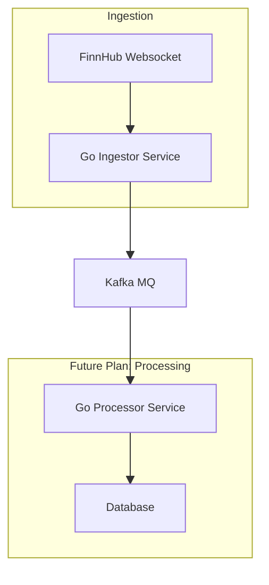

# Real-Time Financial Data Ingestion Pipeline

A microservice that connects to FinnHub via WebSocket, ingests stream of trades complete with last-price updates, then send the trades to a Kafka message queue, making it ready for downstream consumption and processing.

## Planned Architecture

## Tech Stack
* **Go**: Core programming language. Chosen for robust networking and concurrency supports.
* **Finnhub API**: Data source providing real-time financial market data via WebSocket.
* **Gorilla WebSocket**: library for handling WebSocket connections to the Finnhub API.
* **Apache Kafka**: Message queue for asynchronous data streaming between services.
* **Docker**: Containerisation to ensure consistent environments and simplify deployment.

## How to Run
1. Clone repository.
2. Setup configuration, write a `config.yml` file to put on a `config` folder; include FinnHub token, Kafka URL and topic, and subscribed symbols.
3. Start the stack with Docker Compose.
