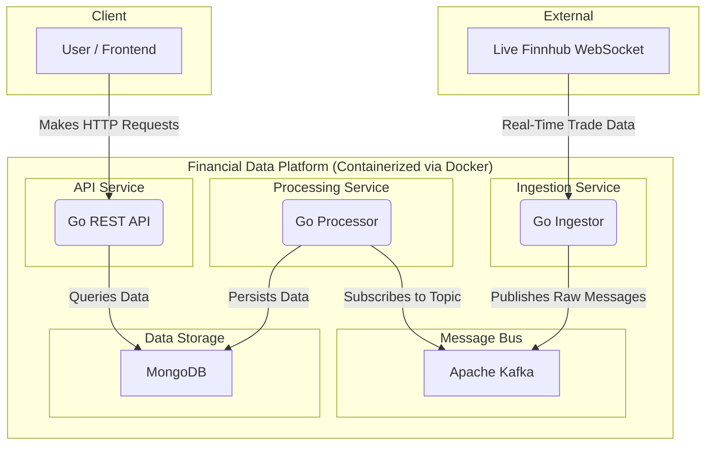

# End-to-End Real-Time Financial Data Platform


An end-to-end, event-driven data platform built in Go. This system ingests live financial data from a WebSocket, streams it through a Kafka message bus, processes and stores it in MongoDB, and exposes it via a clean, well-tested REST API.
## System Architecture

The project is a multi-microservice application, fully containerised with Docker, demonstrating a decoupled, scalable, and resilient architecture.



## Key Features & Technical Highlights

This project demonstrates several advanced, production-ready engineering concepts:

*   **Decoupled & Scalable Architecture**: The Ingestion and Processing services are fully decoupled using **Apache Kafka** as a message bus. This provides two major benefits:
    1.  **Resilience**: Kafka acts as a durable buffer, ensuring that if the database is slow or temporarily unavailable, no incoming real-time data is lost.
    2.  **Horizontal Scalability**: The processing service can be scaled out by running multiple instances. Kafka's **consumer group** model guarantees that each message is delivered to exactly one processor, enabling safe, parallel processing of the data stream without duplication.

*   **Deliberate Pivot to Eventual Consistency**: The initial design aimed for perfect atomicity using multi-document transactions. However, during implementation, it was discovered that **MongoDB's Time Series engine does not support inserts within transactions.** A deliberate architectural decision was made to pivot to an **eventually consistent** model, where we prioritise the absolute durability of the raw trade data while updating the aggregated metadata on a best-effort basis.

*   **Idempotent Data Processing**: The Go Processor is designed to be idempotent. It generates a **deterministic key** from Kafka message metadata (`topic-partition-offset-symbol-timestamp-index`) for each trade. This allows MongoDB's unique index to automatically reject duplicate writes, guaranteeing that data is processed **exactly once**, even if a message is redelivered after a crash.

*   **Concurrent-Safe Metadata Updates**: To avoid race conditions when scaling the processor, all metadata updates are performed within a single `UpdateOne` command. **MongoDB guarantees atomicity for operations that modify a single document.** By using atomic operators like `$inc` and `$max` together in one operation, we ensure that `tradeCount` and ``lastTradeAt`` are updated as a single, uninterruptible unit, making data more consistent without complex application-level locking.
    *   *Reference: [MongoDB Documentation on Atomicity](https://www.mongodb.com/docs/manual/core/write-operations-atomicity/)*

*   **Clean Architecture API**: The REST API is built following Clean Architecture principles, separating concerns into `Handler`, `Usecase (Service)`, and `Repository` layers. This makes the code organised, maintainable, and highly testable.

*   **Robust API Design with Custom Middleware**: The API is protected by a chain of custom Gin middleware. A **request timeout middleware** actively races handler execution against a timer, protecting the server from slow downstream operations like MongoDB’s cloud database suddenly malfunctioning. A **centralised error middleware** catches all application-level errors and context cancellations, ensuring the API always returns a clean, predictable JSON error response.

*   **Cursor-Based Pagination for Time-Series Data**: To paginate time-series trade data, the `/trades` endpoint avoids traditional limit/offset. Instead, it implements **cursor-based pagination**. The API provides a `next_cursor` (the timestamp of the last item) in its response, which the client then uses to request the subsequent page of results. (If no cursor is provided, then we the database runs out of subsequent results.)


*   **Comprehensive Testing Strategy**: The project is validated with a multi-layered testing approach, demonstrating a commitment to code quality and reliability:
    *   **Unit Tests** for core business logic, achieving **100% statement coverage** on the API's Usecase layer and **82% coverage** on the Processor's critical data transformation logic.
     *  **Unit and Integration Tests for the API's Request Layer**, validating the complete interaction between the Handler and Usecase and the Middleware chain. These tests achieved **96% coverage** on the middleware package and confirmed the system's resilience by verifying robust error handling and request timeout behavior.
    *   **Integration Tests** for the Repository layer, achieving **82% coverage** by running against a real test database to verify MongoDB query behaviour. This includes a specific test to validate the **idempotency strategy**, proving that the unique `message_key` index successfully prevents duplicate data insertion on message re-delivery.

## Tech Stack

| Category      | Technology                                             |
|---------------|--------------------------------------------------------|
| **Language**  | Go                                                     |
| **Pipeline**  | Apache Kafka, Gorilla WebSocket                        |
| **API**       | Gin (Web Framework)                                    |
| **Database**  | MongoDB (with Time Series Collections)                 |
| **Testing**   | Go Standard Library, `testify`, `mockery`              |
| **DevOps**    | Docker, Docker Compose                                 |

## API Endpoints

The API provides the following MVP endpoints for data consumption:

#### Get All Tracked Symbols
- **Endpoint**: `GET /api/v1/symbols`
- **Description**: Returns metadata for all symbols the system has processed.
- **Example Response**:
  ```json
  {
      "data": {
          "available": [
              {
                  "symbol": "AMD",
                  "trade_count": 8,
                  "last_trade_at": "2025-11-20T12:42:48.093Z"
              },
              {
                  "symbol": "NVDA",
                  "trade_count": 7,
                  "last_trade_at": "2025-11-20T12:39:40.831Z"
              },
              {
                  "symbol": "TSLA",
                  "trade_count": 5,
                  "last_trade_at": "2025-11-20T12:41:40.175Z"
              }
          ]
      },
      "error": null,
      "message": null
  }
  ```

#### Get Latest Trades for a Symbol
- **Endpoint**: `GET /api/v1/trades/:symbol`
- **Description**: Returns a paginated list of the most recent trades for a symbol using efficient cursor-based pagination.
- **Query Parameters**: `limit` (int), `before` (Unix ms timestamp)
- **Example Response**:
  ```json
  {
      "data": {
          "data": [
              {
                  "timestamp": "2025-11-20T13:33:18.585Z",
                  "price": "196.38",
                  "volume": "265"
              },
              {
                  "timestamp": "2025-11-20T13:33:12.457Z",
                  "price": "196.29",
                  "volume": "100"
              },
              {
                  "timestamp": "2025-11-20T13:33:08.27Z",
                  "price": "196.39",
                  "volume": "115"
              },
              {
                  "timestamp": "2025-11-20T13:33:06.456Z",
                  "price": "196.49",
                  "volume": "100"
              },
              {
                  "timestamp": "2025-11-20T13:33:03.544Z",
                  "price": "196.6",
                  "volume": "300"
              }
          ],
          "pagination": {
              "next_cursor": 1763645583544
          }
      },
      "error": null,
      "message": null
  }
  ```

## Getting Started

### Prerequisites
*   Go (1.21+)
*   Docker & Docker Compose

### 1. Configuration

Create a `config/config.yml` file in the project root with the following structure, filling in your credentials:

```yml
api_port: "8000"

finnhub:
  token: YOUR_FINNHUB_TOKEN

kafka:standard address.
  broker_url: "kafka:29092" 
  topic: "raw_stock_ticks"

subscribed_symbols:
  - "AAPL"
  - "GOOGL"
  - "TSLA"
  - "MSFT"
  - "NVDA"
  - "AMD"

mongodb:
  url: YOUR_MONGODB_ATLAS_URL
  database_name: "financialDataDatabase"
  collection_name: "finnhub_trades"
  symbols_collection_name: "symbols"
```

### 2. Run the Application

From the project root, start the entire platform with a single command:
```bash
docker compose up --build
```
The API will be available at `http://localhost:8000`.

## Running Tests

The project includes a comprehensive test suite. To run all tests, you first need to provide a connection string for a test database in a `.env` file.

1.  **Create a `.env` file** in the project root:
    ```env
    # .env
    MONGO_URL_TEST="..."
    ```

2.  **Run the tests** with the coverage flag:
    ```bash
    go test ./... --cover
    ```

## Demonstrating Horizontal Scalability

This architecture is designed to scale horizontally. You can run multiple instances of the `go-processor` to handle higher data loads, and Kafka's consumer group will automatically distribute the work.

#### 1. Prepare `docker-compose.yml`

First, edit your `docker-compose.yml` file. To run multiple instances, you must **remove or comment out the `container_name` line** from the `go-processor` service.

```yml
  go-processor:
    # container_name: go-processor  <-- Remove this line
    build: ...
```

#### 2. Run with the `--scale` Command

From your project root, start the application and scale the processor to three instances with this command:

```bash
docker compose up --build --scale go-processor=3
```

#### 3. Verify Load Balancing

To see the processors working in parallel, open a new terminal and follow their logs:

```bash
docker compose logs -f go-processor
```

You will see logs from different instances (e.g., `go-processor-1`, `go-processor-2`) processing different Kafka partitions, confirming that the load is being shared.

## Future Improvements

*   **Data Reconciliation Service**: Build a background cron job to periodically recalculate the `symbols` metadata from the raw `finnhub_trades` data, ensuring long-term consistency in the eventually consistent model.

