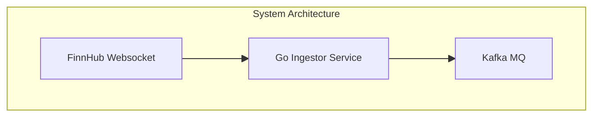

# Real-Time Financial Data Pipeline

Engineered a containerised data pipeline in Go that ingests real-time financial data from the Finnhub WebSocket API and publishes it to a Kafka topic, enabling scalable, decoupled downstream processing and analytics.

## Planned Architecture



## Tech Stack
* **Go**: Core programming language. Chosen for robust networking and concurrency supports.
* **Finnhub API**: Data source providing real-time financial market data via WebSocket.
* **Gorilla WebSocket**: library for handling WebSocket connections to the Finnhub API.
* **Apache Kafka**: Message queue for asynchronous data streaming between services.
* **Docker**: Containerisation to ensure consistent environments and simplify deployment.

## How to Run
1. Clone repository.
2. Setup configuration by writing a `config.yml` file to insert to a `config` folder:

```yml
finnhub:
  token: 

kafka:
  broker_url: 
  topic: 

subscribed_symbols:
  - ...
```

3. Start the stack with `docker-compose up --build`.
